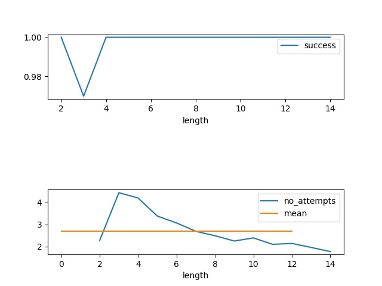

# Wordle Solver

## Wordle Crack/Solver Firefox Extension
A Firefox extension that automates solving the Wordle game, leveraging logic to analyze feedback and make optimal guesses.

### Features
- Automatically enters guesses and evaluates feedback
- Adheres to Wordle's rules

### How to Use

1. Install the Extension:
    1.1 Clone the repository        
    1.2 Open Firefox and go to about:debugging.
    1.3 Click on "This Firefox" and select "Load Temporary Add-on."
    1.4 Choose the `manifest.json` file in the firefox-extension folder

2. Use the Solver:
    2.1 Navigate to the [Wordle website.](https://nytimes.com/games/wordle/index.html)
    2.2 Click on the extension icon in the toolbar.
    2.3 The solver will start automatically and attempt to solve the Wordle puzzle.

*It might take a few seconds to start, and to solve the puzzle.*

Shold you not see anythign happening, please check the console for any errors and open an issue.

## Inital Base Functionality

Simulating the [Wordle](https://en.wikipedia.org/wiki/Wordle) Game im `wordlee.py` and solving it automatically in `crack_wordlee.py`.

In `run_evaluation.job` I ran the 'crack' for 100 times for every word-size from 2 to 14.

The results can be obtained by running `eval_wordlee_crack.py`. A short summary of the success-rate and mean number of tries for every length can be seen in the plots below. 

## LICENSE
MIT License (c) 2021-2025 Tilman Kerl